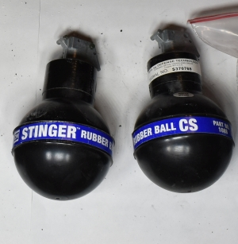

 

Munitions used by city, county, state, and federal law enforcement against racial justice protesters in Portland, Oregon:

Item                                                                                                                                                                                                                                                                                                                                                                                                                                                                                                                                                                                                                                                                                                                                                                                                                                                                                                                                                                                                                                                                                  Manufacturer                                                                                             Name                                                                                                                                                          Safety Data Sheet                                                                                                                                            Spec Sheet                                                                                                                                                                                   
------------------------------------------------------------------------------------------------------------------------------------------------------------------------------------------------------------------------------------------------------------------------------------------------------------------------------------------------------------------------------------------------------------------------------------------------------------------------------------------------------------------------------------------------------------------------------------------------------------------------------------------------------------------------------------------------------------------------------------------------------------------------------------------------------------------------------------------------------------------------------------------------------------------------------------------------------------------------------------------------------------------------------------------------------------------------------------  -------------------------------------------------------------------------------------------------------  ------------------------------------------------------------------------------------------------------------------------------------------------------------  -----------------------------------------------------------------------------------------------------------------------------------------------------------  ------------------------------------------------------------------------------------------------------------  -------------------------------------------------------------------------------
                                                                                                                                                                                                                                                                                                                                                                                                                                                                                                                                                                                                                                [Qian Wei Paintball Support Co.Ltd](https://web.archive.org/web/20190111210057/http://pround-aps.com/)   [P.Round™](https://web.archive.org/web/20190111210057/http://pround-aps.com/ProundSpec.htm)                                                                                                                                                                                                                                                                                                                                                                                                                             
                                                                                                                                                                                                                                                                                                                                                                                                                                                                                                                                                                                                                                [Qian Wei Paintball Support Co.Ltd](https://web.archive.org/web/20190111210057/http://pround-aps.com/)   [P.Round™](https://web.archive.org/web/20190111210057/http://pround-aps.com/ProundSpec.htm)                                                                                                                                                                                                                                                                                                                                                                                                                             
                                                                                                                                                                                                                                                                                                                                                                                                                                                                                                                                                                                                 [Defense Technology®](https://www.defense-technology.com/)                                               [Stinger® 40 mm 60-Caliber Rubber Balls Round](https://www.defense-technology.com/product/stinger-40-mm-60-caliber-rubber-balls-round/)                       [Safety Data Sheet](files/munitions_library/000003/Defense Technology 6097 - 40MM 60 Caliber Stinger Rubber Ball Smokeless Round.pdf)                        [Specification Sheet](files/munitions_library/000003/40mm-Stinger-60-Cal-Rubber-Ball-Round-6097.pdf)                                                                                         
![The SKAT Shell is pictured on concrete ground, held in place by a person's hand with gun metal grey nailpolish. The shell is a long cylindrical tube with a lip at the bottom, similar to a shotgun shell. It's made of what looks like stainless steel or aluminum. Silver in color. Faint scratch lines along the metal that are more known than felt. It looks to be about 5 inches long. Stamped on the shell in a thin paint designed for metal cans like soda pop and beer are the words; `Defence Technology, SKAT shell, CS, 40 millimeter multiple projectile.` SAFARILAND is written at the bottom with a part number and expiration date.](files/munitions_library/000004/DSC_0129.jpg)                                                                                                                                                                                                                                                                                                                                                                                  [Defense Technology®](https://www.defense-technology.com/)                                               [Skat Shell® 40 mm Multiple Projectile Round, CS](https://www.defense-technology.com/product/skat-shell-40-mm-multiple-projectile-round-cs/)                  [Safety Data Sheet](files/munitions_library/000004/Defense Technology 6172 - Skat Shell 40 mm Multiple Projectile Round CS.pdf)                              [Specification Sheet](files/munitions_library/000004/40mm-Skat-Shell.pdf)                                                                                                                    
                                                                                                                                                                                                                                                                                                                                                                                                                                                                                                                                                        [Defense Technology®](https://www.defense-technology.com/)                                               [Spede-Heat™ 40 mm Long-Range Round, Saf-Smoke™](https://www.defense-technology.com/product/spede-heat-40-mm-long-range-round-saf-smoke/)                     [Safety Data Sheet](files/munitions_library/000005/Defense Technology 6183 - Spede-Heat 40mm Long-Range Round - Saf-Smoke.pdf)                               [Specification Sheet](files/munitions_library/000005/40mm-Spede-Heat-Long-Range.pdf)                                                                                                         
![An aluminum cylinder of roughly 5 inches long and 40 millimeters wide is pictured on a smooth concrete floor. The cylinder is stamped with metal paint that reads; `CM, Skat Shell, Saf-Smoke, 40 millimeter multiple projectile` The shell has a Defence Technologies logo on the bottom of it, and a warning message below it indicating this product is for authorized personnel only. Beneath this it says `Safariland` above an experation date and a product number. The shell itself resembles a large shotgun shell, lipped at the bottom of the cylander.](files/munitions_library/000006/DSC_0140.jpg)                                                                                                                                                                                                                                                                                                                                                                                                                                                                    [Defense Technology®](https://www.defense-technology.com/)                                               [Skat Shell® 40 mm Multiple Projectile Round, Saf-Smoke™](https://www.defense-technology.com/product/skat-shell-40-mm-multiple-projectile-round-saf-smoke/)   [Safety Data Sheet](files/munitions_library/000006/Defense Technology 6173 - 40mm Skat-Shell Round Smoke.pdf)                                                [Specification Sheet](files/munitions_library/000006/40mm-Skat-Shell.pdf)                                                                                                                    
![The casings for 4 direct impact rounds are pictured. The casing appears to the eye, short and stubby compared to other shell casings pictured in this library. In truth, the munition is about the same length as all of the other rounds when the foam bullet is housed within it. Without the foam round, the casing is only just over two inches long. Lettering on the casing says `Direct Impact Marking` in green paint on the smooth aluminum. The round is lipped at the bottom and from this angle we can see where the firing pin is meant to strike to ignite the black powder and propell the round. The firing pin strike zone is made of copper or brass and slightly dimpled in the very center. Numbers are inset into the metal on either side of the strike zone.](files/munitions_library/000007/DSC_0170.jpg)                                                                                                                                                                                                                                                   [Defense Technology®](https://www.defense-technology.com/)                                               [Direct Impact® 40 mm Marking Crushable Foam Round](https://www.defense-technology.com/product/direct-impact-40-mm-marking-crushable-foam-round/)             [Safety Data Sheet](files/munitions_library/000007/Defense Technology 6326 - Direct Impact 40mm Marking Crushable Foam Round.pdf)                            [Specification Sheet](files/munitions_library/000007/40mm-Direct-Impact-Round.pdf)                                                                                                           
                                                                                                                                                                                                                                                                                                                                                                                                                                                                                                                                                                                                                                                                                                                                                                                                        [Defense Technology®](https://www.defense-technology.com/)                                               [eXact iMpact™ 40 mm Standard Range Sponge Round](https://www.defense-technology.com/product/exact-impact-40-mm-standard-range-sponge-round/)                 [Safety Data Sheet](files/munitions_library/000008/Defense Technology 6325 - eXact iMpact 40mm Sponge Round.pdf)                                             [Specification Sheet](files/munitions_library/000008/40mm-eXact-iMpact-Sponge-Round-6325_Updated-Specs.pdf)                                                                                  
                                                                                                                                                                                                                                                                                                                                                                                                                                                                                                                                                                                                                                                                                                                                                                        [Defense Technology®](https://www.defense-technology.com/)                                               [OC/CS Aerosol Grenade](https://www.defense-technology.com/product/oc-cs-aerosol-grenade/)                                                                    [Safety Data Sheet](files/munitions_library/000009/Defense Technology 1050 - Aerosol Grenade - OC and CS.pdf)                                                [Specification Sheet](files/munitions_library/000009/OC_CS-Aerosol-Grenade.pdf)                                                                                                              
                                                                                                                                                                                                                                                                                                                                                                                                                                                                                                                                                                                                                                                                                                                                     [Defense Technology®](https://www.defense-technology.com/)                                               [Riot Control Continuous Discharge Grenade, CS](https://www.defense-technology.com/product/riot-control-continuous-discharge-grenade-cs/)                     [Safety Data Sheet](files/munitions_library/000010/Defense Technology 1082 - Riot Control Continuous Discharge Grenade CS - US.pdf)                          [Specification Sheet](files/munitions_library/000010/Riot-Control-Grenade.pdf)                                                                                                               
                                                                                                                                                                                                                                                                                                                                                                                                                                                                                                                                                                                                   [Defense Technology®](https://www.defense-technology.com/)                                               [Flameless Tri-Chamber OC Grenade](https://www.defense-technology.com/product/flameless-tri-chamber-oc-grenade/)                                              [Safety Data Sheet](files/munitions_library/000011/Defense Technology 1030 - Smoke TriChamber Grenade - OC.pdf)                                              [Specification Sheet](files/munitions_library/000011/Tri-Chamber-Flameless-Grenade.pdf)                                                                                                      
                                                                                                                                                                                                                                                                                                                                                                                                                                                                                                                                                                                                                                                               [Defense Technology®](https://www.defense-technology.com/)                                               [Pocket Tactical Grenade, Saf-Smoke™](https://www.defense-technology.com/product/pocket-tactical-grenade-saf-smoke/)                                          [Safety Data Sheet](files/munitions_library/000012/Defense Technology 1017 - Pocket Tactical Grenade - Saf-Smoke.pdf)                                        [Specification Sheet](files/munitions_library/000012/Pocket-Tactical-Grenade.pdf)                                                                                                            
                                                                                                                                                                                                                                                                                                                                                                                                                                                                                                                                                                                                                                                          [Defense Technology®](https://www.defense-technology.com/)                                               [Pocket Tactical Grenade, CS](https://www.defense-technology.com/product/pocket-tactical-grenade-cs/)                                                         [Safety Data Sheet](files/munitions_library/000013/Defense Technology 1016 - Pocket Tactical Grenade CS - US.PDF)                                            [Specification Sheet](files/munitions_library/000013/Pocket-Tactical-Grenade.pdf)                                                                                                            
![three parts of a Defense Technology Triple Chaser SAF Smoke Grenade set next to each other with yellow text identifying the canisters. The canisters are aluminum, and designed to stack together, so there's a flared aluminum seat above 2 of the 3 canisters, resembling a small cookie tin without a lid. On the third piece, a lid is crimped on smoothly with a trigger mechanism within the lid. The trigger mechanism here is shown as metal components missing pieces due to being used. Around the trigger mechanism, 4 holes are machined into the trigger lid surrounding the trigger machanism itself. Inside the seats of the two canisters without triggers, 4 machined holes set into their lids around the center of the canister, and a 5th hole in their centers.](files/munitions_library/000014/DSC_0209.jpg)                                                                                                                                                                                                                                                  [Defense Technology®](https://www.defense-technology.com/)                                               [Triple-Chaser® Separating Canister, Saf-Smoke™](https://www.defense-technology.com/product/triple-chaser-separating-canister-saf-smoke/)                     [Safety Data Sheet](files/munitions_library/000014/Defense Technology 1027 - Triple-Chaser Separating Canister - Saf-Smoke.PDF)                              [Specification Sheet](files/munitions_library/000014/Triple-Chaser-Grenade.PDF)                                                                                                              
![three parts of a Defense Technology Triple Chaser CS Grenade set next to each other with black scuffed text identifying the canisters. The canisters are aluminum, and designed to stack together, so there's a flared aluminum seat above 2 of the 3 canisters, though this is not shown well here as one of the canisters seems to have fallen apart and the other appears to have nearly completely melted, the flared aluminum seats usually resemble a small cookie tin without a lid. On the third piece, a lid is crimped on smoothly with a trigger mechanism within the lid. The trigger mechanism here is shown with the plastic trigger still covering the metal trigger mechanism. Around the trigger mechanism, 4 holes are machined into the trigger lid surrounding the trigger machanism itself. Inside the seats of the two canisters without triggers, 4 machined holes set into their lids around the center of the canister, and a 5th hole in their centers. Though this is not shown for the melted canister.](files/munitions_library/000015/DSC_0216.jpg)   [Defense Technology®](https://www.defense-technology.com/)                                               [Triple-Chaser® Separating Canister, CS](https://www.defense-technology.com/product/triple-chaser-separating-canister-cs/)                                    [Safety Data Sheet](files/munitions_library/000015/Defense Technology 1026 - Triple-Chaser Separating Canister CS - US.pdf)                                  [Specification Sheet](files/munitions_library/000015/Triple-Chaser-Grenade.PDF)                                                                                                              
                                                                                                                                                                                                                                                                                                                                                                                                                                                                                                                                                                                                                                                                                                                                                                                                [Defense Technology®](https://www.defense-technology.com/)                                               [Instantaneous Blast OC Grenade](https://www.defense-technology.com/product/instantaneous-blast-oc-grenade/)                                                  [Safety Data Sheet](files/munitions_library/000016/Defense Technology 1040 - Instantaneous Blast Grenade - OC.pdf)                                           [Specification Sheet](files/munitions_library/000016/Instantaneous-Blast-Grenade.pdf)                                                                                                        
                                                                                                                                                                                                                                                                                                                                                                                                                                                                                                                                                                                                                                                                                                                                             [Defense Technology®](https://www.defense-technology.com/)                                               [Instantaneous Blast CS Grenade](https://www.defense-technology.com/product/instantaneous-blast-cs-grenade/)                                                  [Safety Data Sheet](files/munitions_library/000017/Defense Technology 1042 - Instantaneous Blast CS Grenade.pdf)                                             [Specification Sheet](files/munitions_library/000017/Instantaneous-Blast-Grenade.pdf)                                                                                                        
                                                                                                                                                                                                                                                                                                                                                                                                                                                                                                                                                                                                                                                              [Defense Technology®](https://www.defense-technology.com/)                                               [Maximum HC Smoke Military-Style Canister](https://www.defense-technology.com/product/maximum-smoke-hc-military-style-canister/)                              [Safety Data Sheet](files/munitions_library/000018/Defense Technology 1083 - Military-Style Maximum Smoke HC Grenade.pdf)                                    [Specification Sheet](files/munitions_library/000018/Maximum-Coverage-HC-Smoke-Grenade_Military-Style.pdf)    [Source](https://twitter.com/Antifa_Phoenix/status/1284824128281669632)        
                                                                                                                                                                                                                                                                                                                                                                                                                                                                                                                                                                                                                                              [Defense Technology®](https://www.defense-technology.com/)                                               [Military-Style Green Smoke Grenade](https://www.defense-technology.com/product/military-style-green-smoke-grenade/)                                          [Safety Data Sheet](files/munitions_library/000019/Defense Technology 1065 - Military-Style Smoke Grenade - Green.pdf)                                       [Specification Sheet](files/munitions_library/000019/Colored-Smoke-Grenade.pdf)                                                                                                              
                                                                                                                                                                                                                                                                                                                                                                                                                                                                                                                                                                                        [Defense Technology®](https://www.defense-technology.com/)                                               Military-Style Orange Smoke Grenade                                                                                                                           [Safety Data Sheet](files/munitions_library/000020/Defense Technology 1066 - Military-Style Smoke Grenade - Orange.pdf)                                      [Specification Sheet](files/munitions_library/000020/Colored-Smoke-Grenade.pdf)                                                                                                              
                                                                                                                                                                                                                                                                                                                                                                                                                                                                                                                                                                                                                                                                                                                                      [PepperBall®](https://www.pepperball.com/)                                                               [INERT](https://www.pepperball.com/products/inert/)                                                                                                           [Safety Data Sheet](files/munitions_library/000021/sds_SDS-Inert-081115.pdf)                                                                                 [Specification Sheet](files/munitions_library/000021/spec-round-inert-19141.pdf)                                                                                                             
                                                                                                                                                                                                                                                                                                                                                                                                                                                                                                                                                          [Defense Technology®](https://www.defense-technology.com/)                                               [Military-Style Saf-Smoke™ Grenade](https://www.defense-technology.com/product/military-style-saf-smoke-grenade/)                                             [Safety Data Sheet](files/munitions_library/000022/Defense Technology 1063 - Military-Style Smoke Grenade - Saf-Smoke.pdf)                                   [Specification Sheet](files/munitions_library/000022/Saf-Smoke-Grenade.pdf)                                                                                                                  
                                                                                                                                                                                                                                                                                                                                                                                                                                                                                                                                                                                                                                                             [PepperBall®](https://www.pepperball.com/)                                                               [LIVE-X™](https://www.pepperball.com/products/live-x/)                                                                                                        [Safety Data Sheet](files/munitions_library/000023/sds_SDS-LiveX-081115.pdf)                                                                                 [Specification Sheet](files/munitions_library/000023/spec_PepperBall-Projectile-Round-Live-X.pdf)                                                                                            
                                                                                                                                                                                                                                                                                                                                                                                                                                                                                                                                                                                                                                    [FN America](https://fnamerica.com)                                                                      [PAVA/OC Powder](https://fnamerica.com/products/less-lethal/projectiles/)                                                                                     [Safety Data Sheet](files/munitions_library/000024/00003685017010-0726(2)_split_3.pdf)                                                                       [Specification Sheet](files/munitions_library/000024/)                                                                                                                                       
                                                                                                                                                                                                                                                                                                                                                                                                                                                                                                                                                                                                                                     [FN America](https://fnamerica.com)                                                                      [Washable Paint](https://fnamerica.com/products/less-lethal/projectiles/)                                                                                     [Safety Data Sheet](files/munitions_library/000025/00003685017010-0726(2)_split_1.pdf)                                                                       [Specification Sheet](files/munitions_library/000025/)                                                                                                                                       
                                                                                                                                                                                                                                                                                                                                                                                                                                                                                                                                                                                                                                                                                                                                               [Defense Technology®](https://www.defense-technology.com/)                                               [Stinger® 32 Caliber Rubber Ball Grenade](https://www.defense-technology.com/product/stinger-32-caliber-rubber-ball-grenade/)                                 [Safety Data Sheet](files/munitions_library/000026/Defense Technology 1090 1090SC- Stinger 32-Caliber Rubber Balls - w wo Safety Clip - North America.pdf)   [Specification Sheet](files/munitions_library/000026/Stinger-Grenade-w_Safety-Clip.pdf)                                                                                                      
![The casing for a direct impact rounds is pictured. The casing appears to the eye, short and stubby compared to other shell casings pictured in this library. In truth, the munition is about the same length as all of the other rounds when the foam bullet is housed within it. Without the foam round, the casing is only just over two inches long. Lettering on the casing says `Direct Impact OC` in orange paint on the smooth aluminum. The round is lipped at the bottom and from this angle we can see where the firing pin is meant to strike to ignite the black powder and propell the round. The firing pin strike zone is made of copper or brass and slightly dimpled in the very center. ](files/munitions_library/000027/DSC_0702.jpg)                                                                                                                                                                                                                                                                                                                            [Defense Technology®](https://www.defense-technology.com/)                                               [Direct Impact® 40 mm OC Crushable Foam Round](https://www.defense-technology.com/product/direct-impact-40-mm-oc-crushable-foam-round/)                       [Safety Data Sheet](files/munitions_library/000027/Defense Technology 6320 - Direct Impact 40mm Round - OC.pdf)                                              [Specification Sheet](files/munitions_library/000027/40mm-Direct-Impact-Round.pdf)                                                                                                           
                                                                                                                                                                                                                                                                                                                                                                                                                                                                                                                                                                                                                 [FN America](https://fnamerica.com)                                                                      [Indelible Paint](https://fnamerica.com/products/less-lethal/projectiles/)                                                                                    [Safety Data Sheet](files/munitions_library/000028/00003685017010-0726(2)_split_4.pdf)                                                                       [Specification Sheet](files/munitions_library/000028/)                                                                                                                                       
                                                                                                                                                                                                                                                                                                                                                                                                                                                                                                                                                                                                                                                                                                                      [PepperBall®](https://www.pepperball.com/)                                                               [MARKING](https://www.pepperball.com/products/marking/)                                                                                                       [Safety Data Sheet](files/munitions_library/000029/00003685017010-0726(2)_split_5.pdf)                                                                       [Specification Sheet](files/munitions_library/000029/spec-round-marking-19141.pdf)                                                                                                           
                                                                                                                                                                                                                                                                                                                                                                                                                                                                                                                                                                                                                                                                                                                                                                                                                    [Combined Systems, Inc.](https://www.combinedsystems.com/)                                               [Tactical Grenade CS Smoke](https://www.combinedsystems.com/product/8230-outdoor-tactical-grenade-cs/)                                                        [Safety Data Sheet](files/munitions_library/000030/CS Model 8230 Tactical CS Smoke Grenade.pdf)                                                              [Specification Sheet](files/munitions_library/000030/8210-8220-8230-CTS-Rev-C.pdf)                                                                                                           
                                                                                                                                                                                                                                                                                                                                                                                                                                                                                                                                                                                                                                                                                                                                                                                                                                  [Combined Systems, Inc.](https://www.combinedsystems.com/)                                               [40MM Outdoor White Smoke Long Range](https://www.combinedsystems.com/product/4210-40mm-outdoor-white-smoke-long-range/)                                                                                                                                                                                                                                                                                                                 [Source](https://twitter.com/KimBrater/status/1285716656329838595/photo/1)     
                                                                                                                                                                                                                                                                                                                                                                                                                                                                                                                                                                                                                                                                                                                                                                                                                                                                                                                                                                                      [Combined Systems, Inc.](https://www.combinedsystems.com/)                                               [40mm Riot CS Smoke Projectile](https://www.combinedsystems.com/product/4230-40mm-cs-smoke-pyro-long-range/)                                                                                                                                                                                                                                                                                                                                                                                                            
                                                                                                                                                                                                                                                                                                                                                                                                                                                                                                                                                                                                                                                                                                                                                                                                                                                                                                                    [Combined Systems, Inc.](https://www.combinedsystems.com/)                                               [40mm White Smoke Multi Projectile (3)](https://www.combinedsystems.com/product/4230-40mm-cs-smoke-pyro-4-8-long-range/)                                                                                                                                                                                                                                                                                                                                                                                                
                                                                                                                                                                                                                                                                                                                                                                                                                                                                                                                                                                                                                                                                                                                                                                                                                                                                                                                                      [Defense Technology®](https://www.defense-technology.com/)                                               [Yellow Smoke](https://www.defense-technology.com/product/military-style-yellow-smoke-grenade/)                                                               [Safety Data Sheet](files/munitions_library/000034/Defense Technology 1069 - Military-Style Smoke Grenade - Yellow.pdf)                                      [Specification Sheet](files/munitions_library/000034/Colored-Smoke-Grenade.pdf)                                                                                                              
                                                                                                                                                                                                                                                                                                                                                                                                                                                                                                                                                                                                                                                                                                                                                                                                                                                                                                                               [Combined Systems, Inc.](https://www.combinedsystems.com/)                                               [Grenade, Non-Lethal](https://www.combinedsystems.com/product/9593-cs-sting-ball-grenade-approx-105-rubber-balls/)                                                                                                                                                                                                                                                                                                                                                                                                      
                                                                                                                                                                                                                                                                                                                                                                                                                                                                                                                                                                                                                                                                                                                                                                                                                                                                                                                                                   RAP4                                                                                                     [PAVA Less Lethal](https://web.archive.org/web/20121215164645/http://www.rap4.com/store/paintball/less-lethal-live-agent-rounds)                                                                                                                                                                                                                                                                                                                                                                                        
                                                                                                                                                                                                                                                                                                                                                                                                                                                                                                                                                                                                                                                                                                                                                                                                                                                                                                                                                                                              [PepperBall®](https://www.pepperball.com/)                                                               [LIVE™](https://www.pepperball.com/products/live/)                                                                                                            [Safety Data Sheet](files/munitions_library/000037/00003685017010-0726(2)_split_2.pdf)                                                                       [Specification Sheet](files/munitions_library/000037/spec-round-LIVE-19141.pdf)                                                                                                              
                                                                                                                                                                                                                                                                                                                                                                                                                                                                                                                                                                                                                                                                                                                                                                                                                                                                                                                  [Combined Systems, Inc.](https://www.combinedsystems.com/)                                               [Riot CS](https://www.combinedsystems.com/product/6230-cs-canister-grenade/)                                                                                  [Safety Data Sheet](files/munitions_library/000038/CS Model 6230 CS Smoke Grenade.pdf)                                                                       [Specification Sheet](files/munitions_library/000038/6210-6220-6230-CTS-Rev-D.pdf)                                                                                                           
                                                                                                                                                                                                                                                                                                                                                                                                                                                                                                                                                                                                                                                                                                                                                                                                                                                                                                                                      [Combined Systems, Inc.](https://www.combinedsystems.com/)                                               [40MM Sting-BALLTM Smokeless 60CAL Rubber Pellet](https://www.combinedsystems.com/product/4558-40mm-60-cal-sting-balls-smokeless-4-8-long/)                   [Safety Data Sheet](files/munitions_library/000039/CS Model 4558 CTG 40mm 0.6 Rubber Ball Smokeless.pdf)                                                     [Specification Sheet](files/munitions_library/000039/4558-CTS-Rev-C.pdf)                                                                                                                     
                                                                                                                                                                                                                                                                                                                                                                                                                                                                                                                                                                                                                                                                                                                                                                                                                                                                                                               [Combined Systems, Inc.](https://www.combinedsystems.com/)                                               [STING BALL](https://www.combinedsystems.com/product/9590-no-irritant-sting-ball-grenade-priced-individually-must-order-in-quantities-of-12/)                 [Safety Data Sheet](files/munitions_library/000040/CS Model 9590 Grenade Sting Ball .314 Pellets.pdf)                                                        [Specification Sheet](files/munitions_library/000040/)                                                                                                                                       
                                                                                                                                                                                                                                                                                                                                                                                                                                                                                                                                                                                                                                                                                                                                                                                                                                                                                                                                          [Sage Control Ordnance Inc.](http://www.sageinternationalltd.com/SCOI/index.html)                        [37MM Sage Rifled - Impact](http://www.sageinternationalltd.com/SCOI/ko1.html)                                                                                                                                                                                                                                                                                                                                                                                                                                          
                                                                                                                                                                                                                                                                                                                                                                                                                                                                                                                                                                                                                                                                                                                                                                                                                                                                                                                                     [Defense Technology®](https://www.defense-technology.com/)                                               [Pocket Tactical Grenade, Green Smoke™](https://www.defense-technology.com/product/tactical-smoke-grenade-green/)                                             [Safety Data Sheet](files/munitions_library/000042/Pocket-Tactical-Grenade.pdf)                                                                              [Specification Sheet](files/munitions_library/000042/6210-6220-6230-CTS-Rev-D.pdf)                            [Source](https://twitter.com/45thabsurdist/status/1292030478556336133/photo/1) 
                                                                                                                                                                                                                                                                                                                                                                                                                                                                                                                                                                                                                                                                                                                                                                                                                                                                                                                                                                    [Defense Technology®](https://www.defense-technology.com/)                                               [Muzzle Blast 40 mm Round, OC](https://www.defense-technology.com/product/muzzle-blast-40-mm-round-oc/)                                                       [Safety Data Sheet](files/munitions_library/000043/Defense Technology 6040 - Muzzle Blast 40 mm Round - OC.pdf)                                              [Specification Sheet](files/munitions_library/000043/40mm-Muzzle-Blast.pdf)                                   [Source](https://twitter.com/R3volutionDaddy/status/1284361273652600832)       
                                                                                                                                                                                                                                                                                                                                                                                                                                                                                                                                                                                                                                                                                                                                                                                                                                                                                                                                                                        [Defense Technology®](https://www.defense-technology.com/)                                               [Spede-Heat™ 40 mm Long-Range Round, CS](https://www.defense-technology.com/product/spede-heat-40-mm-long-range-round-cs/)                                    [Safety Data Sheet](files/munitions_library/000044/Defense Technology 6182 - Spede-Heat 40mm Long-Range Round - CS.pdf)                                      [Specification Sheet](files/munitions_library/000044/40mm-Spede-Heat-Long-Range.pdf)                          [Source](https://twitter.com/R3volutionDaddy/status/1284361273652600832)       
                                                                                                                                                                                                                                                                                                                                                                                                                                                                                                                                                                                                                                                                                                                                                                                                                                                       [Defense Technology®](https://www.defense-technology.com/)                                               [Low Roll® 12-Gram Non-Reloadable Distraction Device®](https://www.defense-technology.com/product/low-roll-12-gram-non-reloadable-distraction-device/)        [Safety Data Sheet](files/munitions_library/000045/Defense Technology 8902NR - 12-Gram Low Roll Non-Reloadable Distraction Device.pdf)                       [Specification Sheet](files/munitions_library/000045/Distraction-Device-Low-Roll-NR-8902NR_8902NR-HH.pdf)     [Source](https://twitter.com/Antifa_Phoenix/status/1284824128281669632)        
                                                                                                                                                                                                                                                                                                                                                                                                                                                                                                                                                                                                                                                                                                                                                                                                                                                                    [Defense Technology®](https://www.defense-technology.com/)                                               [Flameless Tri-Chamber CS Grenade](https://www.defense-technology.com/product/flameless-tri-chamber-cs-grenade/)                                              [Safety Data Sheet](files/munitions_library/000046/Defense Technology 1032 - Tri-Chamber Flameless CS Grenade - US.pdf)                                      [Specification Sheet](files/munitions_library/000046/Tri-Chamber-Flameless-Grenade.pdf)                                                                                                      
                                                                                                                                                                                                                                                                                                                                                                                                                                                                                                                                                                                                                                                                                                                                                                                                                                                                                                                  [Defense Technology®](https://www.defense-technology.com/)                                               [Pocket Tactical Grenade, OC](https://www.defense-technology.com/product/pocket-tactical-grenade-oc/)                                                         [Safety Data Sheet](files/munitions_library/000047/Defense Technology 1019 - Pocket Tactical Grenade OC.pdf)                                                 [Specification Sheet](files/munitions_library/000047/Pocket-Tactical-Grenade.pdf)                                                                                                            
                                                                                                                                                                                                                                                                                                                                                                                                                                                                                                                                                                                                                                                                                                                                                                                                                                                              [Defense Technology®](https://www.defense-technology.com/)                                               [Stinger® CS Caliber Rubber Ball Grenade](https://www.defense-technology.com/product/stinger-cs-rubber-ball-grenade/)                                         [Safety Data Sheet](files/munitions_library/000048/Defense Technology 1088 - Stinger Rubber Ball Grenade -CS.pdf)                                            [Specification Sheet](files/munitions_library/000048/Stinger-Grenade.pdf)                                                                                                                    

 

Notice something missing? 

[Submit munitions to the library!](munition_submission.html)

 

This work is funded by [DAPPER Stats](https://www.dapperstats.com).

 
